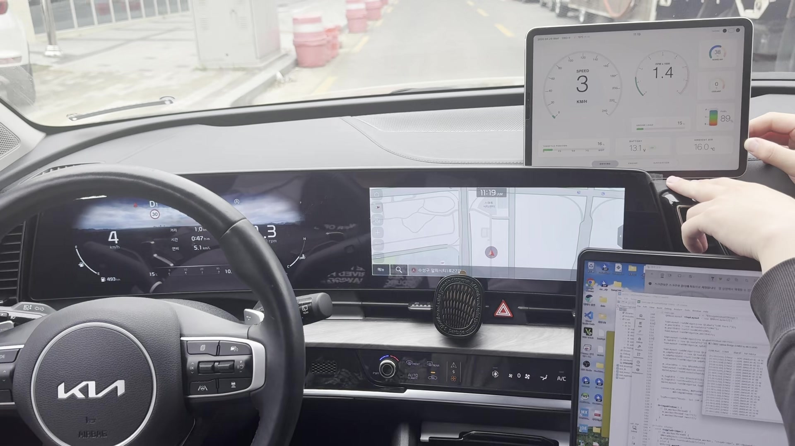

# STM32 OBD-II CAN Monitor for Sportage

4세대 기아 스포티지의 OBD-II CAN 통신을 STM32로 수집하고, UART로 차량
데이터를 확인한 프로젝트입니다. 실제 차량에 배선을 연결한 뒤 SavvyCAN으로
CAN 트래픽과 ID를 확인했습니다.

> 부트캠프 팀 프로젝트에서 제가 담당한 임베디드 작업을 다시 검토하여 공개한
> 포트폴리오용 저장소입니다. Git 커밋 날짜는 최초 개발 기간이 아니라 코드
> 정리 및 공개 시점을 나타냅니다.

## 담당 역할

- 실제 스포티지 4세대 차량의 OBD-II 커넥터와 STM32 CAN 계통 배선
- SavvyCAN을 이용한 CAN 프레임 확인 및 CAN ID 분석
- OBD-II Service 01 PID 요청과 응답 파싱 펌웨어 구현
- RPM, 속도, 스로틀, 연료량, MAF 데이터를 UART 텍스트로 출력
- ST-LINK Virtual COM Port 자동 탐색 및 시리얼 수신 확인

대시보드와 화면 UI는 다른 팀원이 담당했으므로 이 저장소에 포함하지 않았습니다.

## 실차 주행 검증

[](media/driving-demo.mp4)

[주행 검증 영상 보기 (MP4, 약 7MB)](media/driving-demo.mp4)

영상은 실제 차량 주행 중 OBD-II 데이터가 화면에 반영되는지 확인한 기록입니다.
화면에 보이는 대시보드는 다른 팀원이 구현했으며, 저는 STM32와 OBD-II 배선 연결,
CAN 통신 설정, ID 확인과 데이터 수집을 담당했습니다.

## 시스템 구성

```text
Sportage OBD-II (CAN-H / CAN-L)
  -> CAN transceiver
  -> NUCLEO-F042K6 (500 kbit/s)
  -> USART2 / ST-LINK VCP (9,600 bit/s)
  -> Python serial monitor
```

자세한 연결 정보와 주의사항은 [배선 문서](docs/wiring.md)를 참고하십시오.

## 처리 데이터

| 구분 | CAN ID / PID | 변환 |
|---|---|---|
| OBD-II 요청 | `0x7DF` | Service `0x01` |
| ECU 응답 | `0x7E8` | Positive response `0x41` |
| Engine RPM | PID `0x0C` | `((A * 256) + B) / 4` |
| Vehicle speed | PID `0x0D` | `A` km/h |
| Throttle position | PID `0x11` | `A * 100 / 255` % |
| Fuel level input | PID `0x2F` | `A * 100 / 255` % |
| Mass air flow | PID `0x10` | `((A * 256) + B) / 100` g/s |
| Gear candidate | CAN ID `0x43F` | 첫 번째 데이터 바이트 분석 |

`0x43F`는 차량 분석 과정에서 확인한 실험 후보입니다. 차종과 연식에 따라 ID와
데이터 값이 달라질 수 있으므로 일반화된 결과로 사용하면 안 됩니다.

## 표준 OBD-II 밖의 CAN ID 분석 시도

### 목표

표준 OBD-II Service 01 PID로는 RPM, 속도, 스로틀 등의 진단 데이터는 받을 수
있지만 기어 위치와 같은 제조사 고유 신호는 제공되지 않습니다. 따라서
SavvyCAN에서 조작 전후 프레임을 비교해 관련 CAN ID를 찾고, STM32에서도 해당
원시 프레임을 직접 수신하는 것을 목표로 했습니다.

### 시도

- OBD-II 포트에서 수신되는 프레임을 SavvyCAN으로 기록
- 차량 상태를 바꾸기 전후의 ID와 데이터 바이트 변화 비교
- 변화가 관찰된 `0x43F`를 기어 관련 후보로 분류
- STM32 수신 필터를 열고 해당 ID의 반복 수신 여부 확인

### 원하는 신호를 받지 못한 이유

4세대 스포티지는 Gateway ECU를 통해 진단 포트와 차량 내부 CAN 네트워크가
분리되어 있습니다. OBD-II 커넥터에서는 진단 요청과 응답, 일부 허용된 프레임만
확인할 수 있으며 Body CAN이나 다른 내부 네트워크의 모든 원시 프레임이 그대로
전달되지는 않습니다. 따라서 내부 버스에 존재하더라도 Gateway가 전달하지 않는
CAN ID는 OBD-II 포트에 연결한 STM32와 SavvyCAN에서 수신할 수 없습니다.

또한 `0x43F`의 변화만으로 신호 의미를 확정하기에는 다음 정보가 부족했습니다.

- 대상 ECU가 연결된 실제 CAN 채널
- 제조사 DBC 또는 신호 정의
- 바이트 위치, 비트 길이, 엔디언과 스케일
- Rolling counter 및 checksum 여부

결과적으로 `0x43F`는 관찰된 후보로만 남겼으며, 검증되지 않은 기어 값으로
단정하지 않았습니다. 추가 검증에는 Gateway 뒤쪽의 대상 CAN 버스에서 통제된
환경으로 측정하거나 제조사 신호 정의를 확보하는 과정이 필요합니다.

## 주요 설정

| 항목 | 값 |
|---|---|
| Board | NUCLEO-F042K6 |
| MCU | STM32F042K6T6 |
| System clock | 48 MHz |
| CAN bitrate | 500 kbit/s |
| CAN RX / TX | PA11 / PA12 |
| USART2 TX / RX | PA2 / PA15 |
| UART baud rate | 9,600 |
| STM32Cube FW | STM32CubeF0 V1.11.6 |

## 실행

1. STM32CubeIDE에서 저장소 루트의 프로젝트를 가져옵니다.
2. `test_can.ioc` 설정을 확인하고 펌웨어를 빌드·플래시합니다.
3. CAN 트랜시버와 OBD-II 배선을 연결합니다.
4. PC에서 시리얼 모니터를 실행합니다.

```bash
python -m venv .venv
.venv\Scripts\activate
pip install -r requirements.txt
python tools/can.py
```

출력 형식:

```text
RPM=720
SPEED=0
THROTTLE=14
FUEL=62
MAF=3
```

## 프로젝트 구조

```text
.
|-- Core/                  # STM32 application and generated source
|-- Drivers/               # STM32 HAL and CMSIS
|-- docs/wiring.md         # OBD-II and STM32 connection notes
|-- media/                 # 실차 주행 영상과 미리보기 이미지
|-- tools/can.py           # UART serial monitor
|-- test_can.ioc           # STM32CubeMX configuration
|-- requirements.txt
`-- README.md
```

## 코드 이력

- 최초 CubeIDE 프로젝트: OBD-II RPM 요청과 `0x7E8` 응답 확인
- 차량 테스트 버전: 속도, 스로틀, 연료량, MAF PID 처리 추가
- CAN 분석 버전: SavvyCAN에서 확인한 기어 후보 ID 처리 추가

공개본은 실제 차량 테스트 코드를 기준으로 구성했으며, 깨진 문자와 주석 표현만
정리했습니다. 팀원이 구현한 대시보드 코드는 포함하지 않았습니다.

## 제한 사항

- 차량 Gateway ECU 정책에 따라 일부 프레임이 OBD-II 포트에서 보이지 않을 수 있습니다.
- `0x43F` 기어 판정은 실험 후보이며 별도 검증이 필요합니다.
- 원시 CAN 캡처와 차량 식별 정보는 저장소에 공개하지 않습니다.
- 차량 네트워크 연결은 반드시 정차 상태의 통제된 환경에서 수행해야 합니다.
